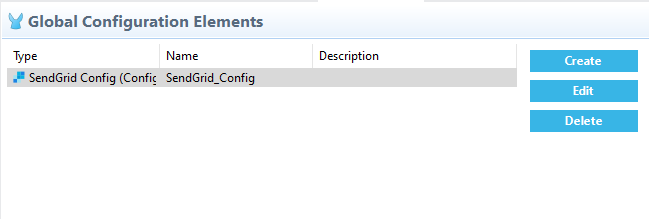

= SendGrid Connector User Manual

== Introduction

SendGrid is a cloud-based SMTP provider that allows you to send email without having to maintain email servers. SendGrid manages all of the technical details, from scaling the infrastructure to ISP outreach and reputation monitoring to whitelist services and real time analytics.

Read through this user guide to understand how to set up and configure a basic flow using the connector. Track feature additions, compatibility, limitations and API version updates with each release of the connector using the https://github.com/EDS-github/mule4-sendgrid-connector-documentation/blob/master/docs/release-notes.adoc[Connector Release Notes]. Review the connector operations and functionality using the https://github.com/EDS-github/mule4-sendgrid-connector-documentation/blob/master/docs/technical-reference.adoc[Technical Reference] alongside the demo application.

MuleSoft maintains this connector under the https://docs.mulesoft.com/mule-runtime/3.8/anypoint-connectors#connector-categories[MuleSoft Certified Category] support policy.

== Prerequisites

This document assumes that you are familiar with Mule 4, https://www.mulesoft.com/platform/cloud-connectors[Anypoint Connectors], and https://docs.mulesoft.com/studio/7.7/[Anypoint Studio]. To increase your familiarity with Studio, consider completing a https://docs.mulesoft.com/studio/7.7/[Anypoint Studio] Tutorial. This page requires some basic knowledge of https://docs.mulesoft.com/mule-runtime/latest/[Mule Concepts], https://docs.mulesoft.com/mule-runtime/latest/mule-components[Components in a Mule Flow], and https://docs.mulesoft.com/mule-runtime/3.8/global-elements[Global Elements].

[[requirements]]
== Hardware and Software Requirements
For hardware and software requirements, please visit the Hardware and https://docs.mulesoft.com/mule-runtime/4.2/hardware-and-software-requirements[Software Requirements page].

=== Mule Compatibility
[%header%autowidth.spread]
|===
|Application/Service |Version
|Mule Runtime |4.3.0 and later
|Anypoint Studio | 7.4.x and later

|===

== Installing the Connector

* You can install the connector in Anypoint Studio using the instructions in https://docs.mulesoft.com/exchange/#installing-a-connector-from-anypoint-exchange[Installing a Connector from Anypoint Exchange.]

== Maven Dependency Information
After downloading and installing the connector, following steps make the SendGrid connector available inside a Mule application for use and to package the application with connector. If using Anypoint Studio, it will do this automatically. For Maven dependency management, include this XML snippet in pom.xml file in the Mule project.

       <dependency>
            <groupId>com.sendgrid.connector</groupId>
            <artifactId>sendgrid-connector</artifactId>
            <version>1.0.0</version>
            <classifier>mule-plugin</classifier>
       </dependency>

== How to Configure

* After adding connector dependency to Mule project, click on *Global Elements* tab at the base of the canvas.
* In the Global Mule Configuration Elements screen, click *Create*.
* In the Choose Global Type wizard, collapse connector configuration and select *'SendGrid Config'* and click OK.

[%header%autowidth.spread]
|===
|Field Name |Type |Value
|Base Uri |String |Enter a Windows domain for the user to log in with.
|API Key |String |Enter the Api Key to log in with.
|===

[[ns-schema]]
== Connector Namespace and Schema

When designing your application in Anypoint Studio, when you drag the connector from the palette onto the Anypoint Studio canvas, Studio automatically populates the XML code with the connector *namespace* and *schema location*.

*Namespace:* `+http://www.mulesoft.org/schema/mule/connector+` +
*Schema Location:* `+http://www.mulesoft.org/schema/mule/connector/current/mule-connector.xsd+`

[TIP]
If you are manually coding the Mule application in Studio's XML editor or another text editor, define the namespace and schema location in the header of your *Configuration XML*, inside the `<mule>` tag.

----
<mule xmlns:sendgrid="http://www.mulesoft.org/schema/mule/sendgrid"
      xmlns="http://www.mulesoft.org/schema/mule/core"
	  xmlns:doc="http://www.mulesoft.org/schema/mule/documentation"
	  xmlns:xsi="http://www.w3.org/2001/XMLSchema-instance"
      xsi:schemaLocation="http://www.mulesoft.org/schema/mule/core
      http://www.mulesoft.org/schema/mule/core/current/mule.xsd
      http://www.mulesoft.org/schema/mule/sendgrid
      http://www.mulesoft.org/schema/mule/sendgrid/current/mule-sendgrid.xsd">

      <!-- put your global configuration elements and flows here -->

</mule>
----

== Use Case

This use case explains send mail by using Single Sender.

* Create Dynamic Transactional Template.

* Send mail to recipient using created dynamic template.

*HTTP Listener Endpoint* - listens for HTTP requests.

*Set Variable* - Set flow variable required body.

*Create Transactional Template* - Creates a transactional template.

** Request body for Create Transactional Template.

 output application/json
 ---
 {
     "name": "<<Template Name>>",
     "generation": "dynamic"
 }

*Send Mail* - Sends mail to the recipient from verified senders.

** Request body for Send Mail.

 {
    "personalizations": [
        {
            "to": [
                {
                    "email": "<<Reciever's Email>>",
                    "name": "<<Reciever's Name"
                }
            ],
            "dynamic_template_data": {
                "verb": "",
                "adjective": "",
                "noun": "",
                "currentDayofWeek": ""
            },
            "subject": "<<Email Subject>>"
        }
    ],
    "from": {
        "email": "<<Sender's Email",
        "name": "<<<<Sender's Email>>"
    },
    "reply_to": {
        "email": "<<reply_to email>>",
        "name": "<<reply_to name>>"
    },
    "template_id": "<<template_id>>"
}

== Resources

Access the https://github.com/EDS-github/mule4-sendgrid-connector-documentation/blob/master/docs/release-notes.adoc[SendGrid Connector Release Notes]
